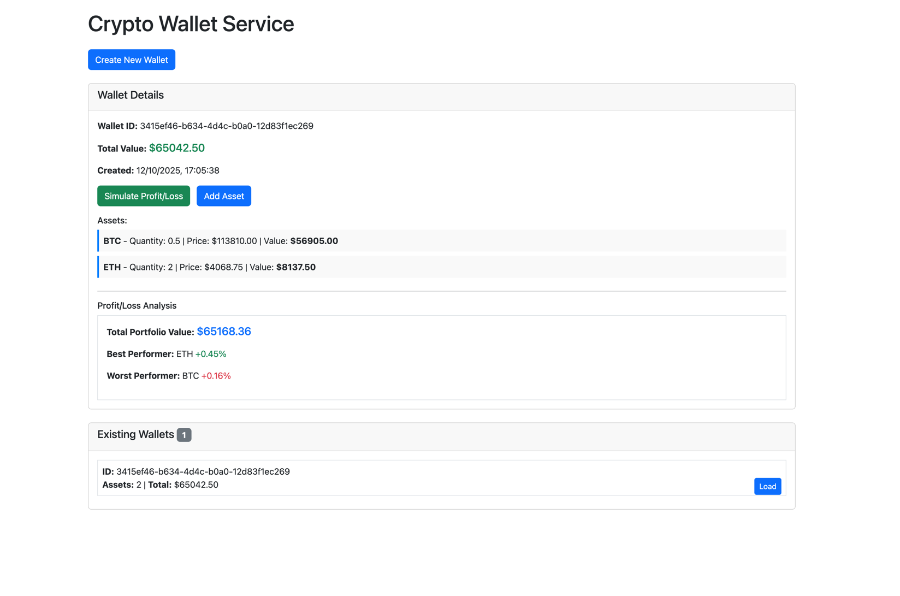

[](https://github.com/devbith/crypto-wallet-service/actions/workflows/gradle.yml)

# Crypto Wallet Service

A cryptocurrency wallet management service built with Java 21, Spring Boot 3, and hexagonal architecture. 
Manage crypto wallets, track assets, and simulate profit/loss scenarios.



## Features
- Create wallets 
- Add crypto assets (BTC, ETH, etc.) with real-time pricing
- Profit/loss simulation based on current market prices

## Architecture
The project follows hexagonal architecture with:
- **Application Layer**: Domain models, business logic, and use case (ports) orchestration
- **Infrastructure Layer**: REST APIs, database adapters, and external service integrations


## Technology Stack

- **Java 21**
- **Spring Boot 3**
- **PostgreSQL**

## Quick Start

### Prerequisites
- Java 21+ 
- Docker (for PostgreSQL)

### Backend SetupThe

```bash
# Clone repository
git clone <repository-url>
cd crypto-wallet-service

# Start PostgreSQL
./gradlew composeUp

# Start application 
COINCAP_API_KEY=${COINCAP_API_KEY} ./gradlew bootRun --args='--spring.profiles.active=dev'

# OR start main method directly with active dev profile
com.crypto.wallet.CryptoWalletApplication::main 
```

### Frontend Setup

```bash
#navigate to webapp directory
cd webapp

# install dependencies
npm install
# start frontend development server
npm run dev
```

### Shutdown
```bash
# Stop PostgreSQL
./gradlew composeDown
```


### How to get COINCAP_API_KEY 
- CoinCap API: https://docs.coincap.io
- Signup for Free to create the apiKey: https://pro.coincap.io/signup
- Assets: https://docs.coincap.io/#89deffa0-ab03-4e0a-8d92-637a857d2c91
- Price history: https://docs.coincap.io/#61e708a8-8876-4fb2-a418-86f12f308978
