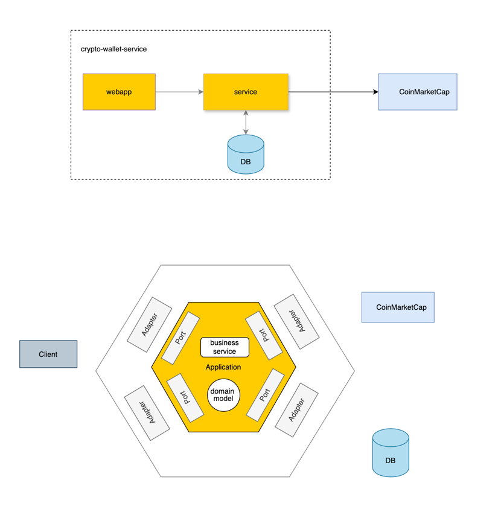

[](https://github.com/devbith/crypto-wallet-service/actions/workflows/gradle.yml)

# Crypto Wallet Service

A cryptocurrency wallet management service built with Java 21, Spring Boot 3, and hexagonal architecture. 
Manage crypto wallets, track assets, and simulate profit/loss scenarios.


## Features
- Create wallets 
- Add crypto assets (BTC, ETH, etc.) with real-time pricing
- Profit/loss simulation based on current market prices

## Architecture

### High Level Overview


# 🎯 What Each Layer Does

### Application Layer (`application/`)
- **Models**: Business entities (`User`, `Wallet`, `Asset`) and value objects
- **Ports**: Interfaces defining what the app can do (`in/`) and what it needs (`out/`)
- **Workflows**: Use case orchestrators that coordinate domain services and external concerns
    - `WalletWorkflow` - Manages wallets and assets using `WalletDomainService`
    - `ProfitSimulationWorkflow` - Calculates profit/loss using `ProfitCalculationService`
- **Services**: Focused domain services used by workflows for specific business logic

### Infrastructure Layer (`infrastructure/`)
- **REST Controllers** (`adapter/in/rest/`) - HTTP endpoints
- **Database** (`adapter/out/postgres/`) - Data persistence
- **External APIs** (`adapter/out/coinmarketcap/`) - Price data
- **Config** - Wiring everything together

---

## 📁 Directory Structure

```
crypto-wallet-service/
├── service/                           # Main application module
│   └── src/
│       ├── main/java/com/crypto/wallet/
│       │   ├── application/           # 🎯 Business Logic Layer
│       │   │   ├── model/            # Domain entities
│       │   │   │   ├── primitives/   # Value objects (Email, WalletId, etc.)
│       │   │   │   ├── Asset.java
│       │   │   │   ├── User.java
│       │   │   │   └── Wallet.java
│       │   │   ├── port/             # Interfaces (Hexagonal Architecture)
│       │   │   │   ├── in/          # Incoming ports (Use Cases)
│       │   │   │   └── out/         # Outgoing ports (Use Cases)
│       │   │   ├── service/         # Domain services
│       │   │   ├── ProfitSimulationWorkflow.java  # Use case orchestrator for P&L calculations
│       │   │   └── WalletWorkflow.java            # Use case orchestrator for wallet operations
│       │   ├── infrastructure/       # 🔧 Technical Layer
│       │   │   ├── adapter/
│       │   │   │   ├── in/          # Incoming adapters
│       │   │   │   │   ├── rest/    # REST controllers & DTOs
│       │   │   │   │   └── cronjob/ # Scheduled tasks
│       │   │   │   └── out/         # Outgoing adapters
│       │   │   │       ├── postgres/    # Database implementations
│       │   │   │       └── coinmarketcap/   # External API clients
│       │   │   └── config/          # Configuration classes
│       │   └── CryptoWalletApplication.java
│       └── test/                     # Test suites
│           ├── integration/         # End-to-end tests
│           ├── architecture/        # Architecture validation tests
│           └── com/crypto/wallet/   # Unit tests mirroring main structure
├── webapp/                          # simple html and javascript web page 
├── deployment/                      # Docker & deployment configs
└── build.gradle                    # Build configuration
```


## 🧪 Testing

- `architecture/` - Validates layer boundaries
- `integration/` - Full end-to-end tests
- `unit/` - Fast isolated business logic tests


## Technology Stack

- **Java 21**
- **Spring Boot 3**
- **PostgreSQL**

# Quick Start

### Prerequisites
- Java 21+ 
- Docker (for PostgreSQL)

### Backend Setup

```bash
# Clone repository
git clone <repository-url>
cd crypto-wallet-service

# Start PostgreSQL
./gradlew composeUp

# Start application 
COINCAP_API_KEY=${COINCAP_API_KEY} ./gradlew bootRun --args='--spring.profiles.active=dev'

# OR start main method directly with active dev profile
com.crypto.wallet.CryptoWalletApplication::main 
```

### Frontend Setup

```bash
#navigate to webapp directory
cd webapp

# install dependencies
npm install
# start frontend development server
npm run dev
```

### Shutdown
```bash
# Stop PostgreSQL
./gradlew composeDown
```


### How to get COINCAP_API_KEY 
- CoinCap API: https://docs.coincap.io
- Signup for Free to create the apiKey: https://pro.coincap.io/signup
- Assets: https://docs.coincap.io/#89deffa0-ab03-4e0a-8d92-637a857d2c91
- Price history: https://docs.coincap.io/#61e708a8-8876-4fb2-a418-86f12f308978
